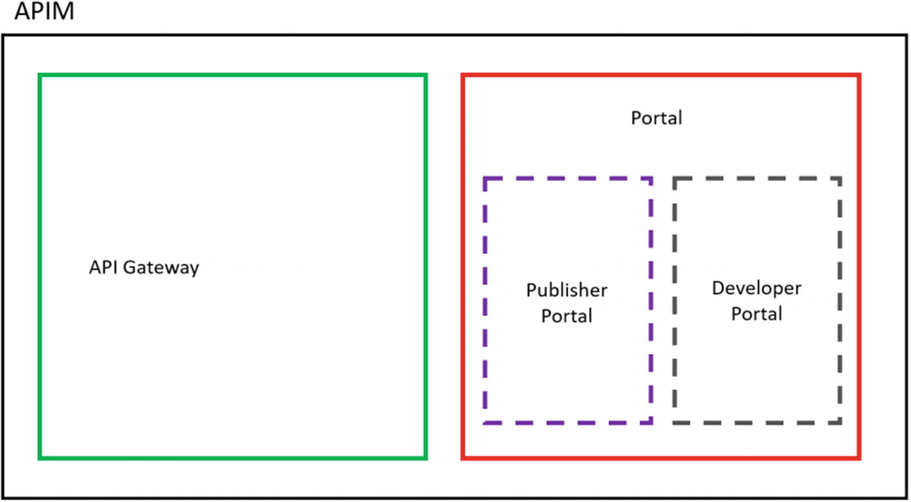
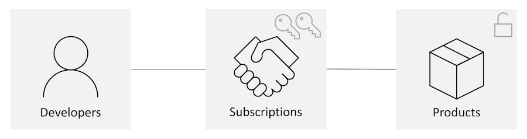
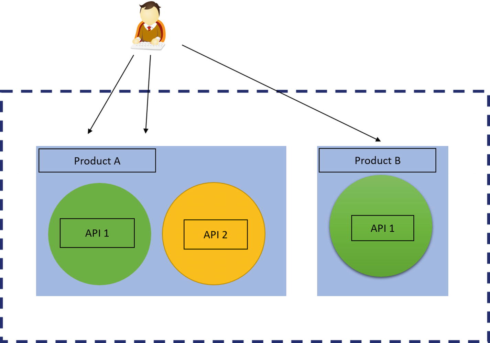

---
## MTN MOMO API JAVA TRAINING

### WI-FI Network: TIA_Events

### Wi-Fi Key:  F33l@TIA# #

---

# Speaker

### Moses Mugisha

- Author of `mtn-momo` library
- Senior Software Engineer At Andela


---
## Themes We shall Explore
- Introduction to the APIs in General
- How Momo API Works
- Java library walk through
- Best Practices

---


### So, why an open API?

MTN Uganda posits that an Open API will enable third parties to easily develop, 
test and deliver new value propositions are likely to produce innovative solutions 
that entice customers to transact more digitally.

---

### Possible use cases to explore

- Interoperability between mobile money and banks, 
or among mobile money providers
- Merchant payments, online and offline, including delegated authentication 
of transactions i.e make payments on behalf of their users
- Bill payments and instant notification of payment
- Basic account management
- International transfers/Remittences, including request for quotation
- Bulk transactions
- Cash in / Cash out
---

### What is an API?

- Application Programming Interface
- interface that a software program presents to other programs, to humans & internet
- mostly intended to be understood and used by humans writing those other programs

---

### Examples Of APIS

- Momo API ;)
- GITHUB API
- Facebook graph API

---

### What makes a great API
- Usability
- Scalability 
- Performance
- Documentation and developer resources

---

### API Paradigms

- REST API
- RPC
- GraphQL
- Websockets
- Webhooks

---

### Which can be Divided into

 
- Request/Response APIs
- Event Driven APIs

---
### Request/Response APIS 

- APIs define a set of endpoints
- Clients make HTTP requests for data to those endpoints and the server returns responses
- The response is typically sent back as JSON or XML or binary.
          - Examples REST, GraphQL,RPC

---

### Event Driven APIS
- An API will send  a message to the configured URL when something happens
- Request/Response APIs can implement this through continuous polling of the server.

       - Examples Websockets, webhooks
 
---

### REST APIs
- Representational State Transfer (REST) 
- Its about resources
- A resource is an entity that can be identified, named,addressed, or handled on the web. 
- REST APIs expose data as resources and use standard HTTP methods to represent CRUD
Create, Read,Update, and Delete (CRUD) transactions against these resources

---

### General Guidelines for REST

- Resources are part of URLs, like /users .

- For each resource, two URLs are generally implemented: 

          - one   for the collection, like /users ,
          - and one for a specific element, like /users/U123 .
          
---          
### Rules Cont ....

- Nouns are used instead of verbs for resources. 

       For example, instead of /getUserInfo/U123  , use /users/U123 
       
 - HTTP methods like GET , POST , UPDATE , and DELETE inform the
    server about the action to be performed
    
    
---

### Rules cont ...

- Different HTTP methods invoked on the same URL provide different functionality

      POST -> for creating new resources
      GET -> for retriving a resource
      DELETE -> for deleting a resource
      PUT  -> for replacing a resource
      PATCH -> for partial update of a resource

---
### What MTN Mobile Money provides?

- sim card as a financial account
- sending and receiving money
- **withdraw and deposit through agents**
- payments (utilities, momo pay, online)
- network services (airtime, bundles)
- **remittances**

---

### with the Open API
 - Your software is a virtual agent

- withdraw from an account with the Collections API
- deposit with Disbursements API
- send money abroad with the Remittances API (NOT COVERED)
- ability to collect payments using MoMo Pay (NOT COVERED)

---

### To Start

Sign Up
Subscribe to a Product
Generate API User and API Key

---

### Developer Account

- Sign up on https://momodeveloper.mtn.com/

- Subscribe to Collections and Disbursement and obtain primary key for each

---

###  API Archtecture

- Leverages Azure API management
- To understand how the API works, we need to understand azure API management

---
### MOMO API Archtecture



---

## Archtecture Cont ...

API Gateway and the portal. 
The portal provides two different experiences, publisher and developer.

---

### API Gateway

 - API Gateway is the core engine
 - receives payment requests, processes them, connects to the backend service,
    and responding to requests.
    
---

### Products

- Products are the consumable packages in Azure API Management. 
- Products contain APIs, and one product can have multiple APIs.
- Also contain usage quota and the terms of use.



---

### Products


---

### Products
- Collections
- Disbursements
- Remittance
- Collection Widget

---
### Subscriptions
- Primary or secondar and are interchangable

- Subscription Keys are associated with a single prodduct 

- The subscription keys act as a first-level security feature, but more importantly, 
they are used to track developers, usage, and policy configurations.
---
### Subscriptions ....

- Developers can also register their applications using the developer portal
- A developer can have more than one subscription to each product. 
- Each subscription is identified by a subscription key, and each subscription key is scoped to a product.
 - A developer cannot use a single subscription key for two different products

---


### Installation

#### Maven users

Add this dependency to your project's POM:

```xml
<dependency>
  <groupId>ug.sparkpl</groupId>
  <artifactId>mtnmomo-java</artifactId>
  <version>1.2.0</version>
</dependency>
```
---
### Gradle users

Add this dependency to your project's build file:

```groovy
compile "ug.sparkpl:mtnmomo-java:1.0.0"
```

---

## Sandbox credentials

Generate sandbox credentials using the command line tool;

```bash
## within the project, on the command line. In this example, our domain is akabbo.ug
$ ./gradlew provisionUser --args='-Ocp-Apim-Subscription-Key \
<primary-Key> --providerCallBackHost akabbo.ug'
```

- providerCallBackHost is your application's domain

- Ocp-Apim-Subscription-Key is your subscription key from momodeveloper account

- You will get a user secret and user id which we will use later

- We have to do this separately for collections and disbursement

---

```bash
 {'apiKey': 'b0431db58a9b41faa8f5860230xxxxxx', \
 'UserId': '053c6dea-dd68-xxxx-xxxx-c830dac9f401'}
```

---


### Configuration

- Best practice to configure as environment variables

---

### Per-request Configuration

``` java

 RequestOptions opts = RequestOptions.builder()
                        .setCollectionApiSecret("MY_SECRET_API_KEY")
                        .setCollectionPrimaryKey("MY_SECRET_SUBSCRIPTION_KEY")
                        .setCollectionUserId("MYSECRET_USER_ID")
                        .setBaseUrl("NEW_BASE_URL")  // Override the default base url
                        .setCurrency("UGX") // Override default currency
                        .setTargetEnvironment("env") // Override default target environment
                        build();

```


---


### For maximum security, implement the integration with MTN in your backend

This way, you will not need any secret keys in your client

---


### Collections

- This operation is used to request a payment from a consumer (Payer). 
- The payer will be asked to authorize the payment.
- The transaction will be executed once the payer has authorized the payment.
- The requesttopay will be in status PENDING until the transaction 
is authorized or declined by the payer or it is timed out by the system

---

### Collections

```java
import java.util.HashMap;
import java.util.Map;

import ug.sparkpl.momoapi.network.RequestOptions;
import ug.sparkpl.momoapi.network.collections.CollectionsClient;


public class MomoCollectionsExample {

    public static void main(String[] args)  {

         // Make a request to pay call
         RequestOptions opts = RequestOptions.builder()
                        .setCollectionApiSecret("MY_SECRET_API_KEY")
                        .setCollectionPrimaryKey("MY_SECRET_SUBSCRIPTION_KEY")
                        .setCollectionUserId("MYSECRET_USER_ID").build();

                HashMap<String, String> collMap = new HashMap<String, String>();
                collMap.put("amount", "100");
                collMap.put("mobile", "1234");
                collMap.put("externalId", "ext123");
                collMap.put("payeeNote", "testNote");
                collMap.put("payerMessage", "testMessage");

                CollectionsClient client = new CollectionsClient(opts);

                try {
                    String transactionRef = client.requestToPay(collMap);
                    System.out.println(transactionRef);
                } catch (MomoApiException e) {
                    e.printStackTrace();
                }
    }
}
```

---


### Requesting a payment

- In sandbox, use EUR as the currency ¯\\\_(ツ)\_/¯
- In production, use the currency of your country
- Use reference of your database transaction record as `externalId`
- `payerMessage` appears on your customer's statement
- `payeeNote` appears on your statement (as a virtual agent)

---


### But the payment is not yet complete

As an agent, you cannot exchange your goods until you are sure the payment has transferred to your account

So how can you be sure that the transaction has been completed?

---


### Polling

- Before exchanging goods, call `getTransaction` with the transaction id every few seconds until it succeeds or fails
- This technique is known as polling

---


### Callback

- if you do not want to poll, you can setup an API endpoint to receive requests from MTN when the transaction status changes,
- you can pass the endpoint url as part of `requestToPay`
- your endpoint should be called when the transaction fails or succeeds
- Note that callbacks do not currently work in the sandbox 

---


### Errors

- a transaction can fail immediately if;
  - credentials are incorrect/invalid/expired
  - the provided parameters are invalid (depending on the environment)
  - the phone number is not registered for mobile money
  - the customer has insufficient balance
- a transaction can fail eventually if;
  - the customer cancels the transaction
  - transaction times out

---


### Disbursements

Deposit money to a mobile money account

---


### Disbursements

```java
import java.util.HashMap;
import java.util.Map;

import ug.sparkpl.momoapi.network.RequestOptions;
import ug.sparkpl.momoapi.network.disbursements.DisbursementsClient;


public class MomoDisbursementsExample {

    public static void main(String[] args)  {

         // Make a request to pay call
         RequestOptions opts = RequestOptions.builder()
                        .setDisbursementApiSecret("MY_SECRET_API_KEY")
                        .setDisbursementPrimaryKey("MY_SECRET_SUBSCRIPTION_KEY")
                        .setDisbursementUserId("MYSECRET_USER_ID").build();


                HashMap<String, String> collMap = new HashMap<String, String>();
                collMap.put("amount", "100");
                collMap.put("mobile", "1234");
                collMap.put("externalId", "ext123");
                collMap.put("payeeNote", "testNote");
                collMap.put("payerMessage", "testMessage");

                DisbursementsClient client = new DisbursementsClient(opts);

                try {
                    String transactionRef = client.transfer(collMap);
                    System.out.println(transactionRef);
                } catch (MomoApiException e) {
                    e.printStackTrace();
                }
    }
}
```

NOTE: remember to use a generate new credentials using a disbursements primary key

---


### Making a payment

- Same as collections;
  - In sandbox, use EUR as the currency ¯\\\_(ツ)\_/¯
  - In production, use the currency of your country
  - Use a reference of your database record as `externalId`
- `payerMessage` appears on your statement
- `payeeNote` appears on the receiver's statement

---


### Making a payment

- Since there is no approval process for disbursements, it safe to assume they complete immediately
- For 100% certainty, you can poll using `disbursements.getTransaction` or use the callback
- Error handling is same as collections
